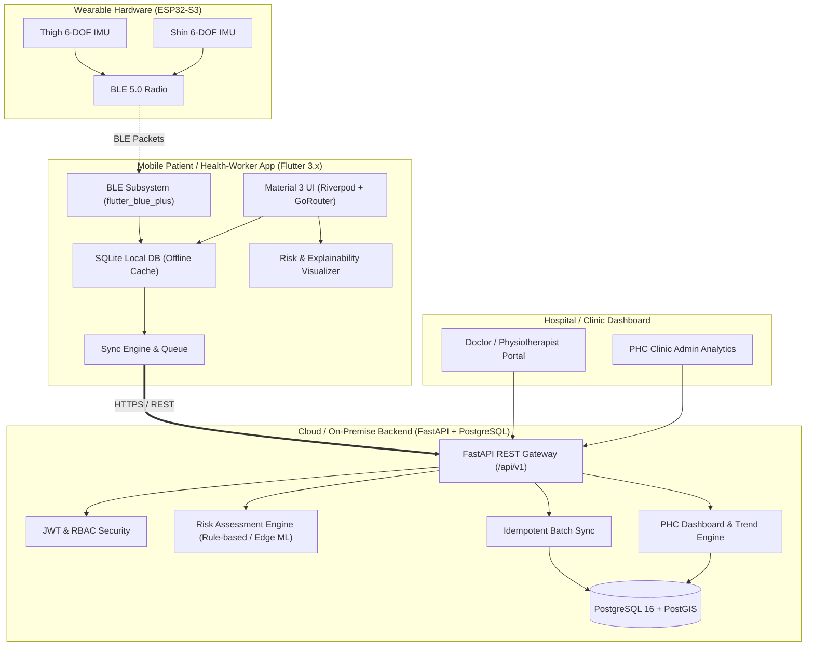
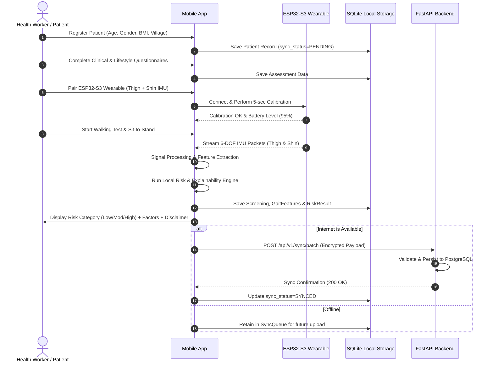

# OSTEOGUARD-NER System Architecture

**DhruveX** | Problem Statement ID: **SIH26004**  
*Move Early. Detect Early. Protect Every Step.*

---

## 1. High-Level Architecture Overview

OSTEOGUARD-NER is an AI-assisted osteoarthritis risk screening and referral-support ecosystem. It bridges low-power wearable biomedical sensors (ESP32-S3 with dual 6-axis IMUs) with frontline healthcare workers and primary health centers (PHCs).

---

## 2. Core Operational Modes

1. **Offline Mode**: Complete screening, questionnaire capture, BLE test conduction, local heuristic risk score calculation, and local PDF export without cellular network or Wi-Fi.
2. **Online Sync Mode**: Automatic detection of active connectivity via `connectivity_plus`, batch syncing queued items with UUID idempotency and conflict preservation.
3. **BLE Connected Mode**: Real-time sensor stream reception at 50Hz, live signal-quality indication, and battery monitoring.
4. **BLE Disconnected/Retry Mode**: Graceful degradation, packet timeout recovery, and retry prompts.
5. **Server Unavailable Mode**: Automatic exponential backoff without interrupting frontline screening workflows.
6. **Incomplete Sensor-Data Mode**: Safety guard preventing fabricated risk scores when IMU sensors are disconnected or drop below 80% data completeness threshold.
7. **Demo Mode**: Full UI and end-to-end workflow demonstration with realistic synthesized biomechanics data without requiring physical hardware.

---

## 3. Data Flow & Screening Lifecycle

---

## 4. Key Subsystem Responsibilities

| Subsystem | Technology | Responsibility |
|---|---|---|
| **Mobile Client** | Flutter 3.x, Dart 3.x, Riverpod | User interface, state management, BLE communication, local database, offline queue. |
| **BLE Communication** | `flutter_blue_plus` | Dual IMU discovery, MTU negotiation, continuous streaming, CRC16 validation. |
| **Local Storage** | `sqflite`, `flutter_secure_storage` | Offline-first persistence of patients, assessments, sessions, and encrypted tokens. |
| **Backend API** | FastAPI, Pydantic v2, Python 3.12 | RESTful endpoints, JWT authentication, RBAC, input validation, audit logging. |
| **Database** | PostgreSQL 16, SQLAlchemy 2.x | Relational storage, PostGIS spatial support for PHC geolocation, JSONB feature storage. |
| **Risk Engine** | Python / Dart Heuristic Engine | Multi-factor risk calculation incorporating biomechanics (asymmetry, knee ROM) and clinical factors (pain, BMI). |
| **Reporting** | Python ReportLab / Dart `pdf` | Clinically formatted PDF screening summaries with disclaimers and trend charts. |
