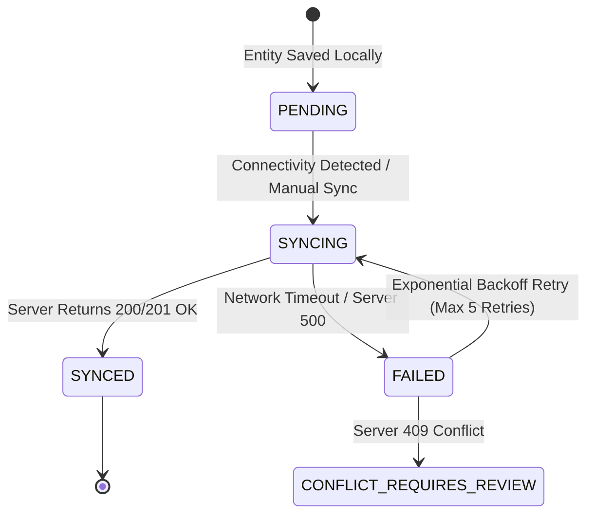

# OSTEOGUARD-NER Offline-First Sync Architecture

**DhruveX** | Resilient Edge Sync Engine

---

## 1. Offline Philosophy & Guarantees

In rural PHCs and community screening camps, cellular data is often intermittent or absent. The OSTEOGUARD-NER app is built strictly offline-first:
- All patient registrations, questionnaires, and sensor screening sessions are saved to SQLite immediately.
- A deterministic rule-based screening engine runs locally on the mobile device to provide instantaneous feedback to the frontline health-worker.
- Every state mutation inserts an immutable transaction into the local `SyncQueue`.
- When connectivity is restored, the `SyncService` drains the queue in strict chronological order with idempotency keys.

---

## 2. Sync State Machine

---

## 3. Conflict Resolution & Idempotency Rules

1. **Idempotency Keys**: Every entity generated locally uses a client-generated UUID v4. The backend checks if the `id` exists before insertion, preventing duplicate records on retry.
2. **Immutability of Screenings**: Once a screening session and its derived gait features are committed, they are considered immutable audit records.
3. **Clinical Overwrite Protection**: If a clinician updates a referral or diagnosis note on the cloud portal, a local draft cannot overwrite the clinician's notes silently.
4. **Exponential Backoff**: Retries are scheduled at $2^n \times 1.5$ seconds (e.g., 3s, 6s, 12s, 24s, 48s) up to a max retry count of 5 before flagging for manual health-worker review.
